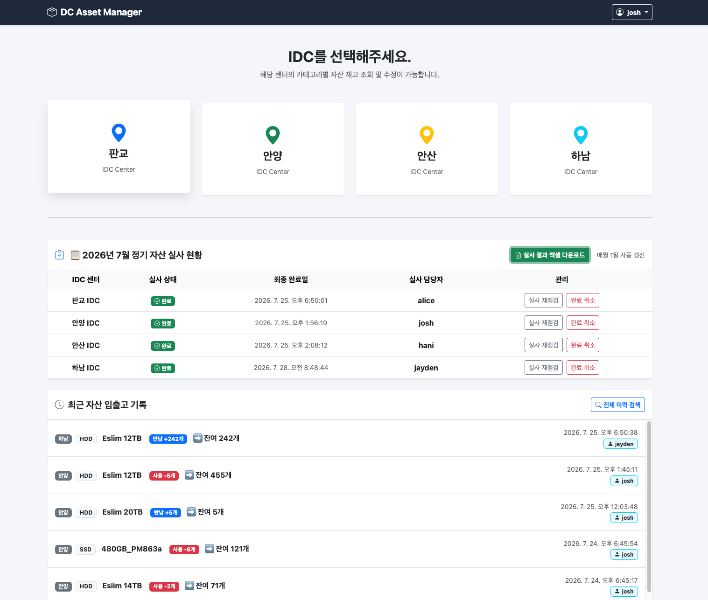
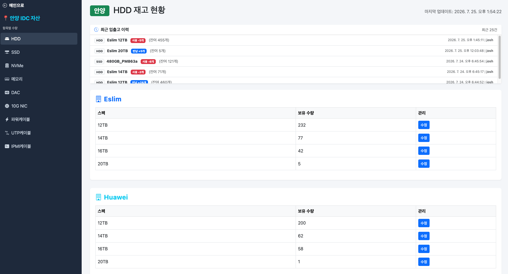
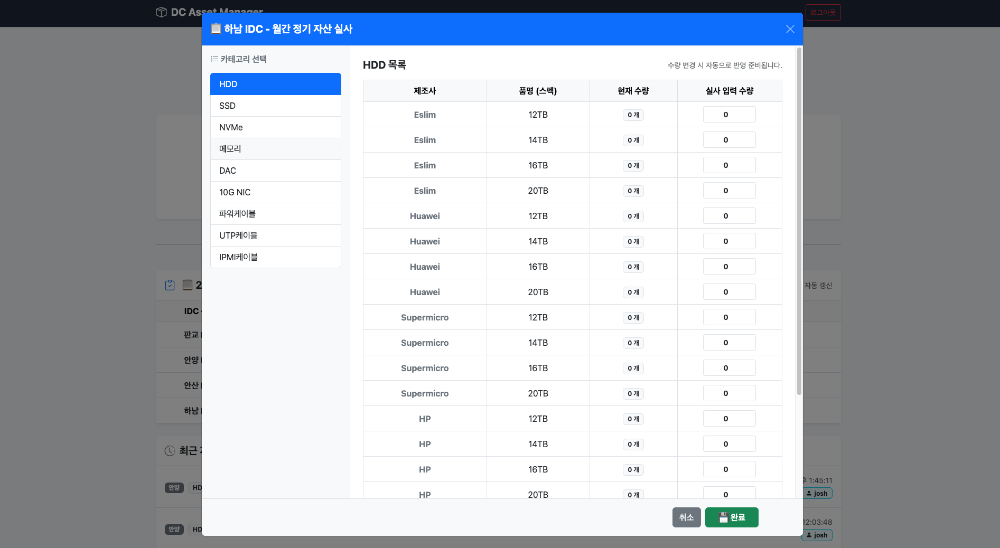
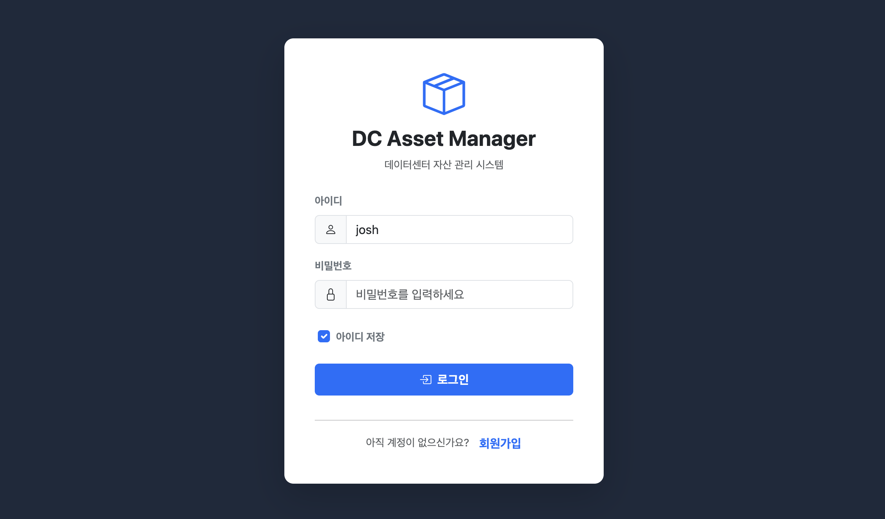
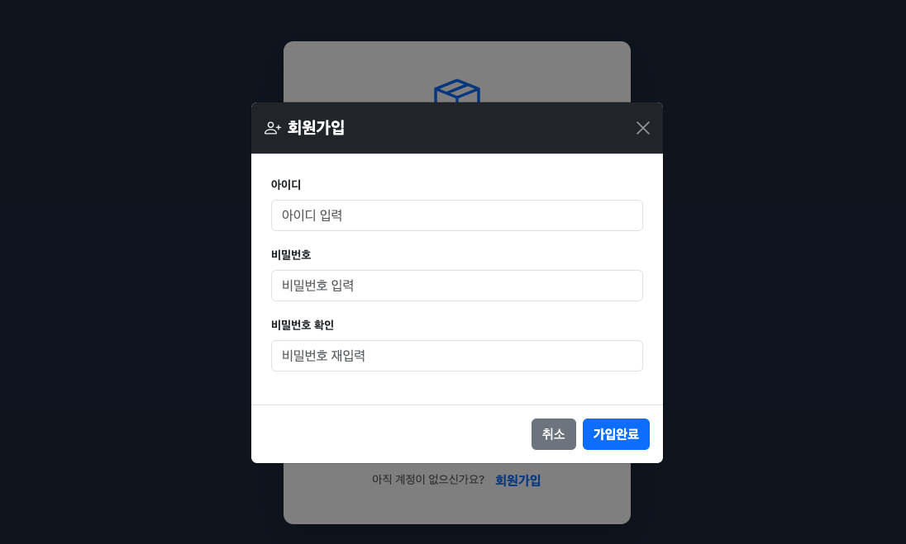

# 🏢 DC Asset Manager v2
[한국어](./README_ko.md)

> A full-stack web application for managing data center (IDC) asset inventory across multiple locations — including stock check-in/check-out, monthly physical inspections, and full change history tracking.

Built to replace spreadsheet-based inventory tracking with a searchable, transaction-safe web interface.

### Dashboard


### DC-wise Stock Status


### Monthly Batch Inspection


### Login


### Sign Up


---

## 🛠️ Tech Stack

- **Backend:** Node.js (Express)
- **Database:** PostgreSQL (`pg` driver)
- **Auth:** express-session, bcrypt (password hashing)
- **Frontend:** HTML5, CSS3, Vanilla JavaScript

---

## ✨ Key Features

### 1. Multi-Location Asset & Stock Overview
- Uses `LEFT JOIN` and `COALESCE` to reliably aggregate stock quantities by IDC location and category, even when records are missing
- Dashboard view summarizing total inventory stats per location

### 2. Concurrency-Safe Stock Transactions
- PostgreSQL **transactions** (`BEGIN` / `COMMIT` / `ROLLBACK`) ensure atomic updates and automatic rollback on failure
- **Upsert** logic (`ON CONFLICT DO UPDATE`) automates stock record creation/updates
- Every stock change (timestamp, user, quantity delta) is logged to a `stock_logs` table for full audit history

### 3. Batch Inventory Inspection
- Tracks monthly physical inspection progress per location (`monthly_inspections`)
- Compares inspection results against system records and auto-generates logs for any discrepancies found

### 4. Authentication & Access Control
- Passwords stored with one-way `bcrypt` hashing
- Session-based login via `express-session`, with middleware-enforced API authorization

---

## 📐 Database Schema (Summary)

| Table | Description |
|---|---|
| `users` | User accounts and hashed passwords |
| `locations` | Data center (IDC) location info |
| `items` | Asset categories, manufacturers, specs |
| `stock` | Per-location stock quantities (composite key: `location_id`, `item_id`) |
| `stock_logs` | History of all stock changes (check-in/out, inspections) |
| `monthly_inspections` | Per-location monthly inspection completion status and owner |

---

## 🚀 Getting Started

```bash
# 1. Clone the repo
git clone https://github.com/Jo00ow-1/DC-Asset-Manager-v2.git
cd DC-Asset-Manager-v2

# 2. Install dependencies
npm install

# 3. Configure environment variables
cp .env.example .env
# then fill in your DB credentials and session secret in .env

# 4. Set up the database schema
psql -U your_username -d your_dbname -f schema.sql

# 5. Start the server
npm start
```

The app will be available at `http://localhost:3000` (or whichever port is set in `.env`).

---

## 📌 Project Status

This is an active personal project (v2 rebuild of an internal tool originally built at work) and is still under development. Current focus areas:
- [x] Finalize `.env.example` and setup docs
- [ ] Add automated tests
- [ ] Deploy a live demo
