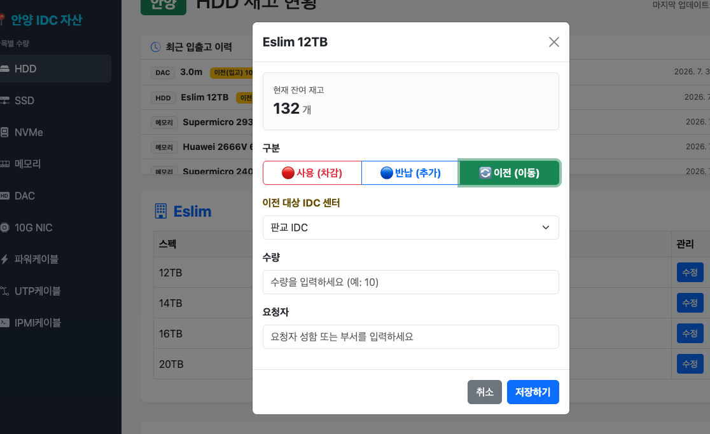
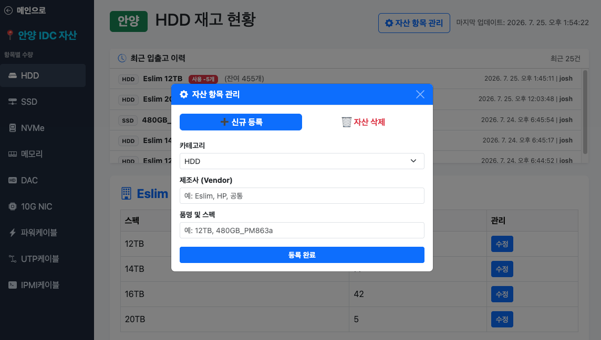
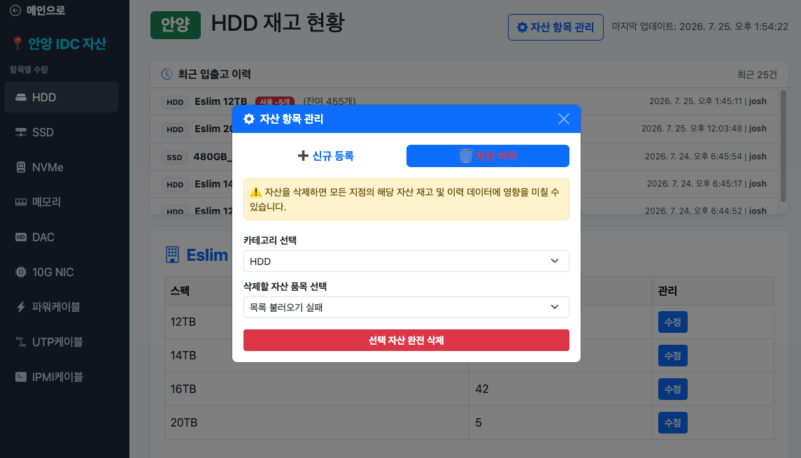

# 🏢 데이터센터 자산 및 재고 관리 시스템 (DC Asset Management)
[English](./README.md)

> Node.js와 PostgreSQL을 활용하여 데이터센터(IDC) 지점별 자산 현황 모니터링, 입출고 관리, 월간 실사 및 이력 추적을 제공하는 풀스택 웹 애플리케이션입니다.

### 대시보드


### DC별 재고 현황


### 지점 간 자산 이전


### 정기 자산실사


### 자산 품목 추가


### 자산 품목 삭제


### 로그인


### 회원가입


---

## 🛠️ Tech Stack

- **Backend:** Node.js (Express)
- **Database:** PostgreSQL (pg Driver)
- **Authentication:** Express-Session, Bcrypt (비밀번호 암호화)
- **Frontend:** HTML5, CSS3, JavaScript (Vanilla JS)
- **Reporting:** xlsx (SheetJS) — 서버 기반 엑셀 내보내기 기능

---

## ✨ 핵심 구현 기능 (Key Features)

### 1. 지점별 자산 및 재고 현황 조회
- `LEFT JOIN` 및 `COALESCE` 구문을 활용해 IDC 지점 및 카테고리별 자산 수량을 누락 없이 조회
- 대시보드를 통해 지점별 총 재고 통계 데이터 제공

### 2. 동시성을 고려한 안전한 입출고(사용/반납) 처리
- **PostgreSQL Transaction (`BEGIN`/`COMMIT`/`ROLLBACK`)** 적용으로 처리 중 오류 발생 시 자동 롤백
- **Upsert (`ON CONFLICT DO UPDATE`)** 구문을 활용해 재고 레코드의 생성 및 업데이트 처리 자동화
- `stock_logs` 테이블을 통해 모든 재고 변동 내역(일시, 사용자, 변동 수량)을 이력으로 기록

### 3. 일괄 자산실사(Batch Inspection) 시스템
- 월간 자산 실사 진행 현황(`monthly_inspections`) 관리
- 실사 결과와 실제 재고 수량 비교 후 차이 발생 시 일괄 업데이트 및 로그 자동 생성

### 4. 보안 및 세션 관리
- `bcrypt` 기반 비밀번호 단방향 암호화 저장
- `express-session`을 이용한 로그인 세션 검증 및 미들웨어 기반 API 권한 제어

### 5. 역할 기반 접근 제어 (관리자 / 일반 사용자)
- `users` 테이블의 `role` 컬럼으로 `admin`/`user` 계정을 구분하고, 매 요청마다 세션 기준으로 검증
- 자산 등록/삭제 같은 관리자 전용 기능은 화면에서만 숨기는 게 아니라 `checkAdmin` 미들웨어로 서버단에서도 차단
- `/api/me`를 통해 로그인한 유저의 권한을 조회해 "자산 항목 관리" 버튼을 동적으로 노출/비노출

### 6. 지점 간 재고 이전
- 사용/반납 외에 "이전" 옵션을 추가해 IDC 지점 간 재고를 직접 이동 가능
- 이전 시 출발지엔 `이전(출고)`, 목적지엔 `이전(입고)` 로그가 한 트랜잭션 안에서 쌍으로 기록되어 데이터 일관성 보장

### 7. 요청자 기록
- 사용/반납/이전 처리 시 요청자 입력을 필수화해, 작업자(`updated_by`)와 별도로 요청자 정보까지 이력에 남김
- 월간 일괄 실사는 전체 재고 수량 파악이 목적이라 요청자 항목을 의도적으로 제외

### 8. 엑셀 내보내기
- 서버에서 `xlsx`(SheetJS) 라이브러리를 이용해 이번 달 전체 지점의 실사 데이터를 `.xlsx` 파일로 다운로드
- 실사 결과 공유 목적이라 관리자 제한 없이 로그인한 모든 사용자가 이용 가능

### 9. 계정 관리
- 사용자명 드롭다운 메뉴에서 현재 비밀번호 확인 후 본인 비밀번호 변경 가능
- 로그아웃 버튼도 같은 드롭다운으로 통합해 헤더 UI 정리

### 10. 전체 이력 검색
- 지점/카테고리/스펙·제조사 검색어로 필터링 가능한 전체 이력 조회 모달
- 대용량 이력 데이터를 위한 페이지네이션(25건씩) 적용

### 11. 월간 실사 리마인더
- 매월 25일 이후 미완료 지점이 남아있으면 대시보드 상단에 닫을 수 있는 경고 배너 표시
- 실사 현황 테이블과 동일한 `/api/inspections/status` 데이터를 재사용해 별도 API 호출 없이 구현

### 12. 실사 완료 취소 이력 관리
- 관리자가 확인 절차를 거쳐 완료된 실사를 "미완료"로 되돌릴 수 있음
- 취소 시점과 담당자(`canceled_by`, `canceled_at`)를 기록해 실사 현황 테이블에서 누가 언제 재오픈했는지 확인 가능

### 13. 관리자 활동 로그
- 자산 추가/삭제 등 관리자 전용 작업을 별도 `admin_logs` 테이블에 작업자·작업 구분·대상 정보와 함께 기록
- 관리자 드롭다운 메뉴에서만 접근 가능한 페이지네이션(25건씩) 지원 로그 모달 제공

---

## 📐 DB 테이블 구조 (ERD Summary)

- **`users`**: 사용자 계정, 암호화된 비밀번호, 권한(`admin`/`user`) 정보
- **`locations`**: IDC 지점 정보
- **`items`**: 자산 카테고리, 제조사, 스펙 정보
- **`stock`**: 지점별 자산 재고 수량 (Composite Key: `location_id`, `item_id`)
- **`stock_logs`**: 자산 입출고/이전/실사 변경 이력 데이터 (입출고·이전 시 요청자 정보 포함)
- **`monthly_inspections`**: 지점별 월간 실사 완료 여부, 완료/취소 담당자 및 일시
- **`admin_logs`**: 관리자 전용 작업(자산 추가/삭제) 감사 로그 — 작업자, 작업 구분, 대상 정보

## 🚀 시작하기

```bash
# 1. 저장소 클론
git clone https://github.com/Jo00ow-1/DC-Asset-Manager-v2.git
cd DC-Asset-Manager-v2

# 2. 패키지 설치
npm install

# 3. 환경변수 설정
cp .env.example .env
# .env 파일에 DB 정보와 세션 시크릿 입력

# 4. DB 스키마 적용
psql -U your_username -d your_dbname -f schema.sql

# 5. 서버 실행
npm start
```
